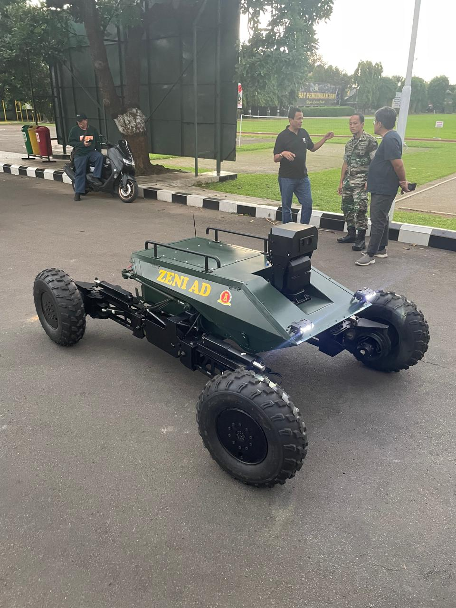

# Lidikzi Robot Documentation 🤖

[](https://example.com) 
[](https://opensource.org/licenses/MIT) 
[](https://github.com/username/repo)

Proyek Lidikzi Robot ini bertujuan untuk menciptakan sistem robotika yang dapat dikontrol secara nirkabel menggunakan ROS (Robot Operating System). Proyek ini memungkinkan kontrol robot secara presisi dalam lingkungan yang memerlukan navigasi independen.

## Pengembang 👥

- **Rifqy Fachrizi** ⚡  
  *Electrical and Motion Programmer*  
  Robot Developer  
  [GitHub](https://github.com/kikifachrizi) • [LinkedIn](https://linkedin.com/in/rifqyfachrizi)

- **Adrian Jotham** 📡  
  *Wireless and ROS Programmer*  
  Robot Developer  
  [GitHub](https://github.com/username) • [LinkedIn](https://linkedin.com/in/username)


## Daftar Isi
- [Fitur Utama](#fitur-utama)
- [Catatan Pemakaian](#catatan-pemakaian)
- [Gambar Dokumentasi](#gambar-dokumentasi)
- [Instalasi](#instalasi)
- [Cara Penggunaan](#cara-penggunaan)
- [Lisensi](#lisensi)
- [Kontribusi](#kontribusi)

## Fitur Utama
- 🚗 Pergerakan: Maju, Mundur, Steering, dan Elevasi.
- 📡 Dikontrol melalui komunikasi WiFi menggunakan ROS2.
- 🛠️ Sistem kontrol independen untuk setiap motor.
- ⏱️ Frekuensi publikasi perintah kontrol sebesar 20Hz.
- 🔄 Sistem otomatis masuk *brake mode* jika tidak ada data selama 2 detik.

## Catatan Pemakaian mode ROS
1. **Kontrol independen:** Tekan tombol `n` untuk mengontrol motor yang ingin dikoreksi (1-8). Atur *trim* dengan tombol `i/o`.
2. **Mode Brake:** Saat naik/turun/belok, aktifkan *brake switch* untuk menghindari pergerakan tidak terkendali.
3. **Perhatikan kabel:** Pastikan jangkauan kabel aman ketika elevasi.
4. **Kontrol belok otomatis:** Tekan terus untuk berbelok, lepaskan untuk berhenti.
5. **Frekuensi kontrol:** 20Hz.
6. **Daya controller:** Pastikan pin 5V terhubung ke STM32 untuk menghindari restart mendadak.
7. **Mode Brake otomatis:** Jika tidak ada data dari tablet dalam 2 detik, sistem akan otomatis masuk *brake mode*.

## Catatan Pemakaian mode RF (Serial) melalui Serial Control App
1. **Aplikasi** Untuk mengakses aplikasi untuk mengontrol menggunakan source code python. (python3 ./serialControlApp/FINALFIXAPP.py).
2. **Executable** Untuk platform windows hanya perlu mengklik dua kali ./serialControlApp/dist/finalcoba.exe
3. **Video** untuk video diperlukan ezcap dengan driver ezcap172 (tersedia untuk windows, Ubuntu belum berhasil). Pastikan setiap kali aplikasi dijalankan OBS hidup/berjalan pada perangkat.
4. **Running** setelah aplikasi dijalankan, perlu mengecek serial com port yang sesuai berdasarkan perangkat yang terhubung, lalu tekan tombol start.
5. **Sending data** jika data berhasil di-relay-kan, data akan dikirim setiap 250ms. Pastikan data terus dikirim yang dapat dilihat pada terminal.
6. **Control** Berdasarkan panel box control, terhadap fungsionalitas untuk Maju, Mundur, Belok Kanan, Belok Kiri, Up (mengangkat), Down (menurun). Kamera pantilt dapat dijalankan ke atas, kanan, kiri, bawah, menggunakan switch berwarna merah. Selain itu ada juga keypad nomor 1 (mengotrol motor linear kanan depan) dan 2(motor linear kiri depan) untuk mengatur belok dari masing-masing ban, memungkinkan kontrol independen pada setiap ban yang akan belok. Jika ingin mengembalikan kontrol tekan (0) pada keypad untuk menggerakan kedua ban.
7. **Troubleshooting** Secara default, skrip di robot akan selalu dijalankan/diulang meskipun koneksi terputus. Jadi penting untuk terus mengirim data secara terus menerus. Jika robot tidak merespon perlu dilakukan restart robot/mencabut-pasang telemetry RF pada robot.
8. **Pengujian** Robot pernah dites dengan jangkauan 160m (Tidak Line of Sight). Untuk Video sedikit samar-samar. Namun sistem kontrol secara teori dapat dikontrol lebih jauh jika dibandingkan dengan video transceiver.
9. **Putus Koneksi** Sistem Failsafe dapat terjadi jika robot tidak terkoneksi dengan aplikasi GCS. Dapat diihat dnegan lampu berkedip pada robot.

## Gambar Dokumentasi
  
*Contoh gambar dari Lidikzi Robot.*

## Instalasi
1. Clone repository:
   ```bash
   git clone https://github.com/username/repo.git
