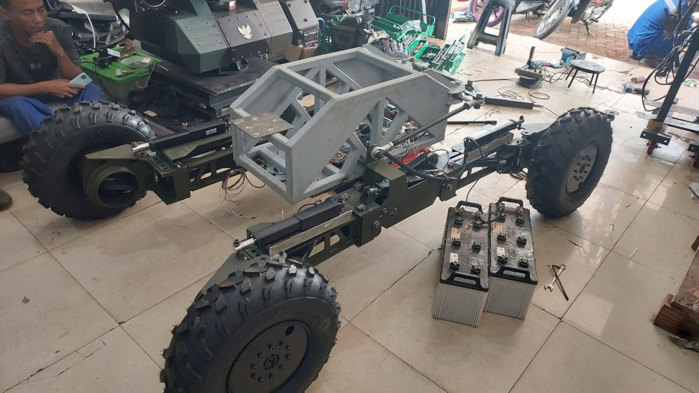

# Lidikzi Robot Documentation 🤖

[](https://example.com) 
[](https://opensource.org/licenses/MIT) 
[](https://github.com/username/repo)

Proyek Lidikzi Robot ini bertujuan untuk menciptakan sistem robotika yang dapat dikontrol secara nirkabel menggunakan ROS (Robot Operating System). Proyek ini memungkinkan kontrol robot secara presisi dalam lingkungan yang memerlukan navigasi independen.

## Pengembang

## Pengembang 👥

- **Rifqy Fachrizi** ⚡  
  *Electrical and Motion Programmer*  
  Robot Developer  
  [GitHub](https://github.com/kikifachrizi) • [LinkedIn](https://linkedin.com/in/rifqyfachrizi)

- **Adrian Jotham** 📡  
  *Wireless and ROS Programmer*  
  Robot Developer  
  [GitHub](https://github.com/username) • [LinkedIn](https://linkedin.com/in/username)


## Daftar Isi
- [Fitur Utama](#fitur-utama)
- [Catatan Pemakaian](#catatan-pemakaian)
- [Gambar Dokumentasi](#gambar-dokumentasi)
- [Instalasi](#instalasi)
- [Cara Penggunaan](#cara-penggunaan)
- [Lisensi](#lisensi)
- [Kontribusi](#kontribusi)

## Fitur Utama
- 🚗 Pergerakan: Maju, Mundur, Steering, dan Elevasi.
- 📡 Dikontrol melalui komunikasi WiFi menggunakan ROS2.
- 🛠️ Sistem kontrol independen untuk setiap motor.
- ⏱️ Frekuensi publikasi perintah kontrol sebesar 20Hz.
- 🔄 Sistem otomatis masuk *brake mode* jika tidak ada data selama 2 detik.

## Catatan Pemakaian
1. **Kontrol independen:** Tekan tombol `n` untuk mengontrol motor yang ingin dikoreksi (1-8). Atur *trim* dengan tombol `i/o`.
2. **Mode Brake:** Saat naik/turun/belok, aktifkan *brake switch* untuk menghindari pergerakan tidak terkendali.
3. **Perhatikan kabel:** Pastikan jangkauan kabel aman ketika elevasi.
4. **Kontrol belok otomatis:** Tekan terus untuk berbelok, lepaskan untuk berhenti.
5. **Frekuensi kontrol:** 20Hz.
6. **Daya controller:** Pastikan pin 5V terhubung ke STM32 untuk menghindari restart mendadak.
7. **Mode Brake otomatis:** Jika tidak ada data dari tablet dalam 2 detik, sistem akan otomatis masuk *brake mode*.

## Gambar Dokumentasi
  
*Contoh gambar dari Lidikzi Robot.*

## Instalasi
1. Clone repository:
   ```bash
   git clone https://github.com/username/repo.git
